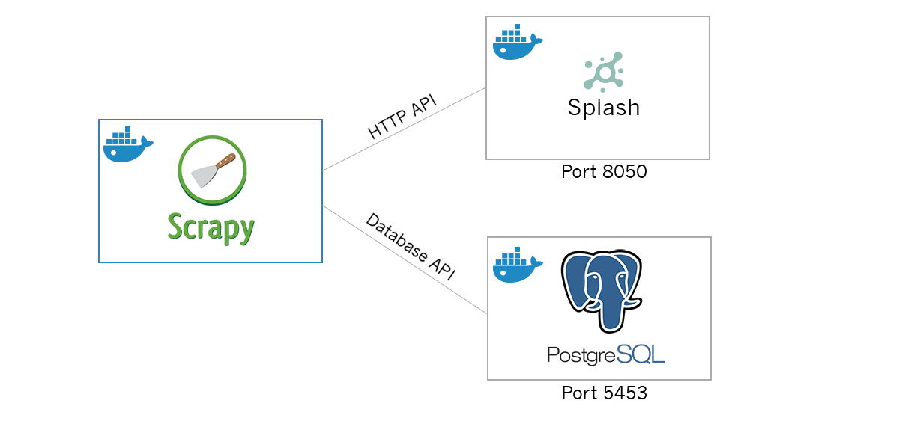

# Yelp Corpus Generator

[](https://travis-ci.org/tybrs/yelp-corpus-generator)

## About
Yelp Corpus Generator is a multi-container Docker web scraping application designed to build a database of restaurant reviews for sentiment analysis. Web scarping is performed in [Scrapy](https://github.com/scrapy/scrapy) with JavaScript integration through [Splash](https://hub.docker.com/r/scrapinghub/splash) and storage in PostgreSQL. Build status logged at [Travis CI](https://travis-ci.org/tybrs/yelp-corpus-generator).



## Installation

### Dependencies

#### Docker and Docker Compose

**Arch Linux**

`$ sudo pacman -S docker docker-compose`

**Other Distros**

For other distributions, follow the instructions [here](https://docs.docker.com/compose/install/) to add repository necessary to install `docker`.

If your preferred package manager does not have a repository for `docker-compose`, the appropriate binary can be added to your local binary directory with the following command.

```$ sudo curl -L "https://github.com/docker/compose/releases/download/1.24.1/docker-compose-$(uname -s)-$(uname -m)" -o /usr/local/bin/docker-compose```

### Build docker image

``$ sudo docker-compose build``

## Configuration

## Usage

Start services and begin scrapping with the following command:

``$ sudo docker-compose up``

## Testing

**TODO**

* Improve documentation and docstrings.
